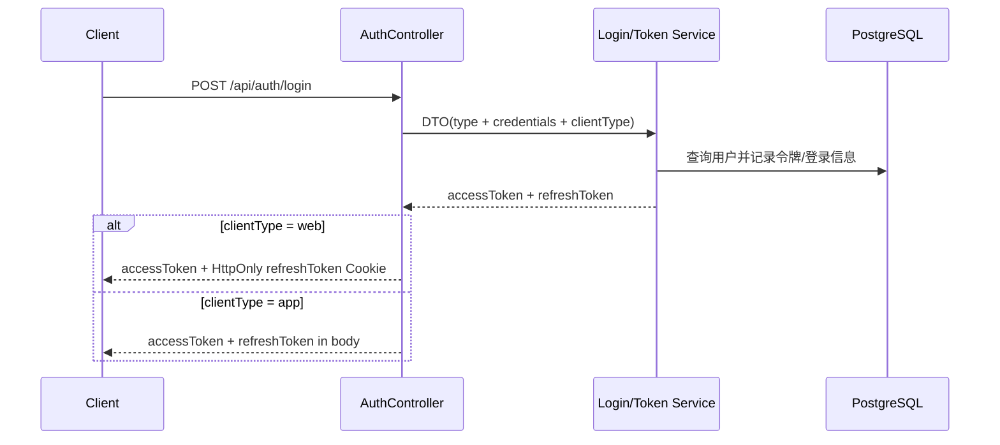
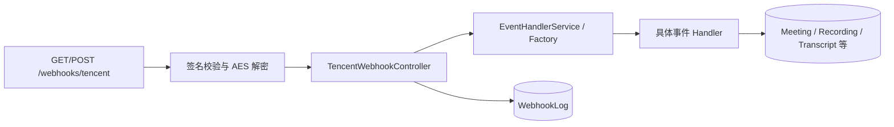
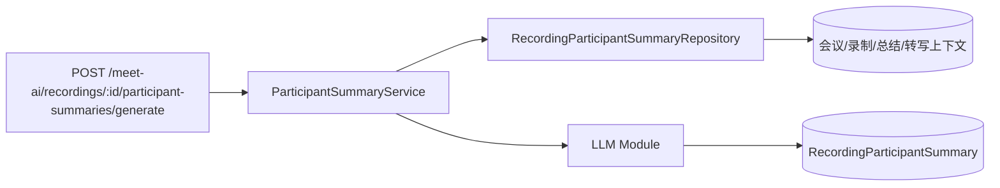

# 关键数据流

本页只描述当前源码中可验证的主路径，不承诺尚未实现的断点续传、熔断、对象存储或可观测性能力。

## 认证与授权

后续请求依次经过 `UnifiedAuthGuard`、`ScopeGuard`、`PermissionGuard`。控制器使用 `@Public()`、`@RequireAuth()`、`@RequireScope()`、`@RequirePermissions()` 或 `@NoPermissionRequired()` 明确例外。

## 腾讯会议 Webhook

URL 验证与事件请求均校验腾讯签名；POST 请求通过 Pipe 解密，再由事件工厂分派。拦截器记录耗时、事件类型和脱敏签名，并将成功或失败状态写入 Webhook 日志。

## 飞书与微信小店队列

- 飞书 `/webhooks/lark` 先持久化原始事件日志，再写入 `lark-events` BullMQ 队列，由 `LarkEventProcessor` 消费。
- 微信小店回调验证签名并解密消息；历史订单同步按时间切片后批量写入 `wechat-order-sync` 队列，由 `WechatShopProcessor` 消费。
- 队列连接来自 Redis 配置，Bull Board 挂载在 `/queues`。

## 会议 AI 总结

参会者总结仓储聚合最新会议关系和转写片段，Service 负责缺失数据判断、Prompt/LLM 编排及结果写入。周期总结由 `POST /meet-ai/summaries/period` 触发。

## 动态系统配置

API 首次启动时把五个服务模块的环境变量一次性导入 `system_configs`，随后只读取数据库值和非敏感代码默认值。管理员通过 `GET/PUT/DELETE /admin/system-config/:module` 读写配置。Service 按 Registry 选择 DTO，校验后加密敏感字段；成功更新或删除会发送 `config.<module>.updated/deleted` 事件，各集成消费者据此刷新运行时配置。

读取敏感字段只返回 `********`；PUT 原样提交该掩码代表保留现有密文。删除配置后不会恢复环境变量，后续重启也不会再次导入。
