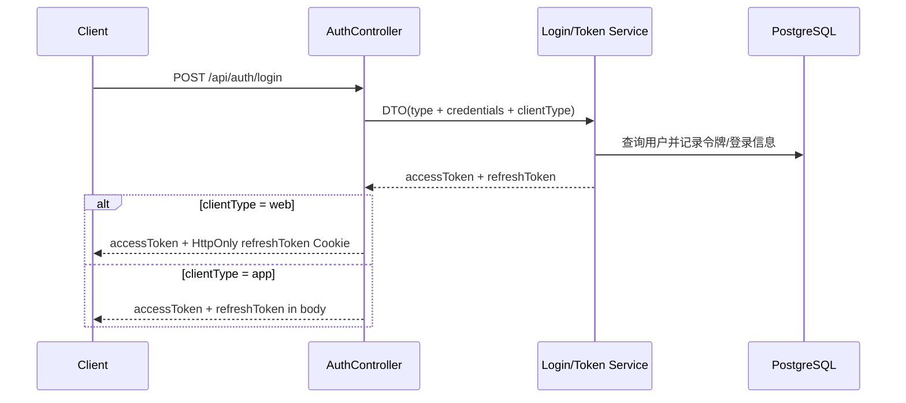
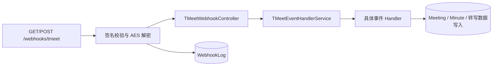
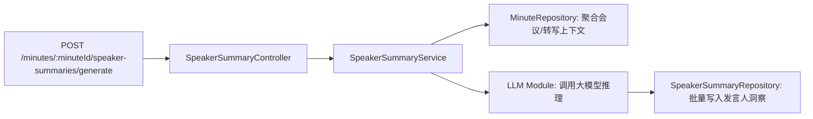
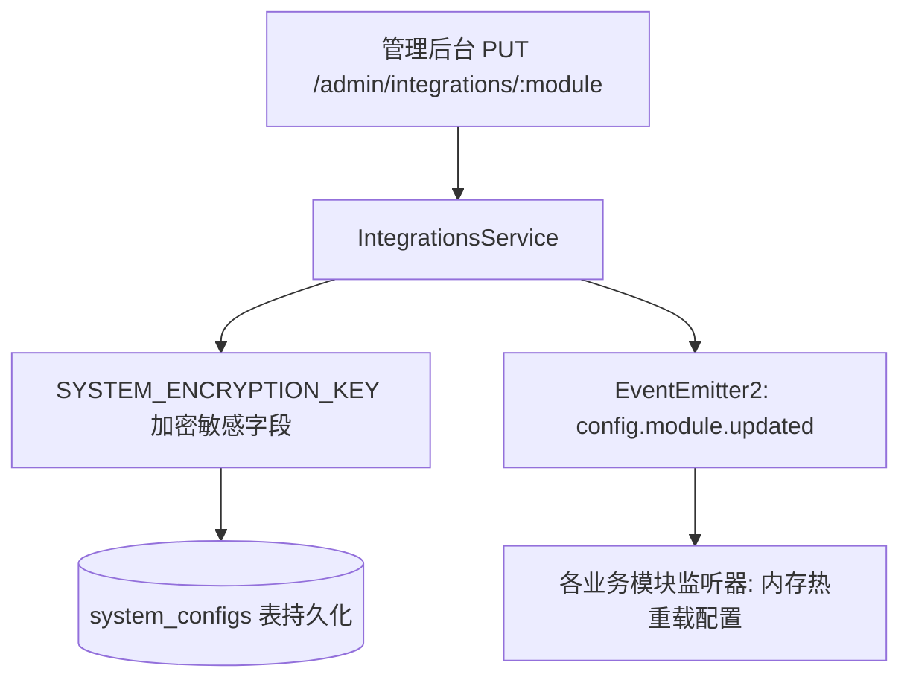

# 关键数据流 (Data Flow)

本页只描述当前源码中可验证的核心主路径，不承诺尚未实现的设想能力。

## 认证与授权

```mermaid
sequenceDiagram
  participant C as Client
  participant A as AuthController
  participant S as Login/Token Service
  participant D as PostgreSQL
  C->>A: POST /api/auth/login
  A->>S: DTO(type + credentials + clientType)
  S->>D: 查询用户并记录令牌/登录信息
  S-->>A: accessToken + refreshToken
  alt clientType = web
    A-->>C: accessToken + HttpOnly refreshToken Cookie
  else clientType = app
    A-->>C: accessToken + refreshToken in body
  end
```

后续请求依次经过 `UnifiedAuthGuard`、`ScopeGuard`、`PermissionGuard`。控制器使用 `@Public()`、`@RequireAuth()`、`@RequireScope()`、`@RequirePermissions()` 或 `@NoPermissionRequired()` 明确访问控制级别。

## 腾讯会议 Webhook 链路

```mermaid
flowchart LR
  A[GET/POST /webhooks/tmeet] --> B[签名校验与 AES 解密]
  B --> C[TMeetWebhookController]
  B --> G[(WebhookLog)]
  C --> D[TMeetEventHandlerService]
  D --> E[具体事件 Handler]
  E --> F[(Meeting / Minute / 转写数据写入)]
```

- URL 验证与事件请求均基于管理后台配置的凭证进行签名校验。
- POST 请求通过 Pipe 解密消息体，再由事件工厂派发。
- 拦截器记录耗时、事件类型和脱敏签名，并将处理状态写入 `webhook_logs` 表。

## 异步任务队列 (BullMQ)

- **飞书事件**：`/webhooks/lark` 先持久化原始事件日志，再写入 `lark-events` 队列，由 `LarkEventProcessor` 异步消费。
- **微信小店订单**：微信回调验签解密后，按时间切片将历史订单批量推入 `wechat-order-sync` 队列，由 `WechatShopProcessor` 消费入库。
- **企业微信 Hermes**：`/webhooks/wecom/events` 验签后入队异步处理，解耦即时响应与大模型推理。
- 队列均由基于 `REDIS_URL` 的 Redis 实例驱动，Bull Board 管理界面挂载在 `/queues`（需 Basic Auth 认证）。

## 会议纪要与 AI 发言人总结

```mermaid
flowchart LR
  A[POST /minutes/:minuteId/speaker-summaries/generate] --> B[SpeakerSummaryController]
  B --> C[SpeakerSummaryService]
  C --> D[MinuteRepository: 聚合会议/转写上下文]
  C --> E[LLM Module: 调用大模型推理]
  E --> F[SpeakerSummaryRepository: 批量写入发言人洞察]
```

- 调用时自动断言目标纪要及会议归属于当前用户的 `orgId`。
- 服务层聚合最新会议参会者列表及转写文本，编排结构化 Prompt 后调用已配置的 LLM（火山方舟/OpenAI），并将生成的行动项与分析结果持久化。

## 动态第三方集成配置与热更新

```mermaid
flowchart TD
  Admin[管理后台 PUT /admin/integrations/:module] --> Svc[IntegrationsService]
  Svc --> AES[SYSTEM_ENCRYPTION_KEY 加密敏感字段]
  AES --> DB[(system_configs 表持久化)]
  Svc --> Event[EventEmitter2: config.module.updated]
  Event --> Listeners[各业务模块监听器: 内存热重载配置]
```

- 支持邮件、AI、腾讯会议、企业微信、飞书、微信小店等服务配置。
- 读取敏感字段时统一返回掩码 `********`；PUT 原样提交该掩码代表保留已有密文不覆盖。
