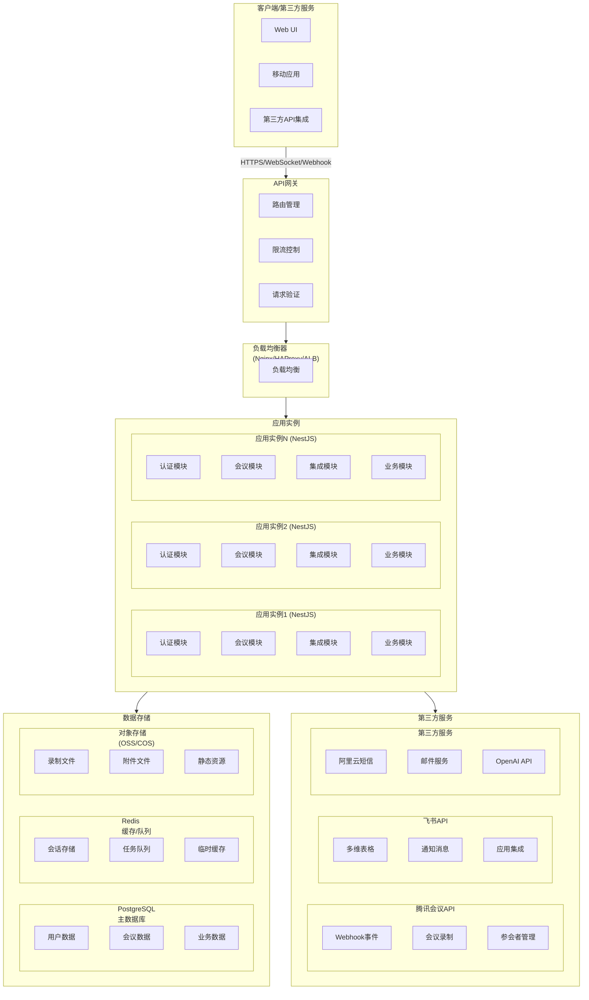

# 系统架构设计文档

## 概述

本文档提供了 LuLab 后端系统的架构概览和详细文档索引。LuLab 后端是一个基于 NestJS 的企业级会议和用户服务系统，提供用户认证、会议管理、第三方服务集成等功能。

## 整体架构概览

### 系统架构图



## 技术栈概览

系统采用现代化的技术栈，包括 Node.js、NestJS、TypeScript、Prisma、PostgreSQL、Redis 等。详细的技术栈信息请参考 [技术栈文档](./tech-stack.md)。

## 架构文档索引

以下文档详细描述了系统架构的各个方面：

### 核心架构文档

| 文档 | 描述 |
|------|------|
| [技术栈](./tech-stack.md) | 详细介绍系统使用的技术栈和第三方服务集成 |
| [模块设计](./modules.md) | 系统模块划分和各模块的职责与交互 |
| [数据流设计](./data-flow.md) | 系统数据流和处理逻辑 |
| [项目结构](./project-structure.md) | 项目目录结构和组织方式 |

## 开发指南

### 快速开始

1. **环境准备**:
   - 安装 Node.js 18.x+ 和 pnpm
   - 安装 PostgreSQL 14+ 和 Redis 7.x
   - 配置环境变量

2. **项目设置**:
   ```bash
   # 克隆项目
   git clone <repository-url>
   cd lulab_backend
   
   # 安装依赖
   pnpm install
   
   # 配置环境变量
   cp .env.example .env
   # 编辑 .env 文件，配置必要的环境变量
   
   # 数据库设置
   pnpm db:generate
   pnpm db:migrate
   pnpm db:seed
   
   # 启动开发服务器
   pnpm start:dev
   ```

3. **访问应用**:
   - API 文档: http://localhost:3000/api
   - 健康检查: http://localhost:3000/health

### 开发流程

1. **代码规范**:
   - 使用 ESLint 和 Prettier 进行代码格式化
   - 遵循 TypeScript 严格模式
   - 编写单元测试和集成测试

2. **提交规范**:
   - 使用 Conventional Commits 规范
   - 提交前运行测试和代码检查
   - 创建 Pull Request 进行代码审查

3. **测试流程**:
   ```bash
   # 运行单元测试
   pnpm test:unit
   
   # 运行集成测试
   pnpm test:integration
   
   # 运行所有测试
   pnpm test:all
   
   # 生成测试覆盖率报告
   pnpm test:cov
   ```

## 部署指南

### 环境配置

系统支持多环境部署，包括开发、测试和生产环境。每个环境有独立的配置和数据库实例。

### 部署方式

1. **传统部署**:
   - 使用 PM2 进行进程管理
   - Nginx 作为反向代理和负载均衡器
   - PostgreSQL 主从复制和 Redis 集群

2. **容器化部署**:
   - 使用 Docker 和 Docker Compose
   - Kubernetes 集群部署
   - Helm Charts 管理部署配置

### 监控和日志

- 使用 Prometheus 和 Grafana 进行指标监控
- ELK Stack 进行日志聚合和分析
- OpenTelemetry 进行分布式追踪

## 总结

LuLab 后端系统采用现代化的技术栈和架构设计，具有高性能、高可用、易扩展的特点。通过模块化设计和微服务架构，系统可以灵活应对业务需求的变化。详细的架构文档可以帮助开发团队更好地理解和维护系统。

如需了解特定方面的详细信息，请参考相应的架构文档。