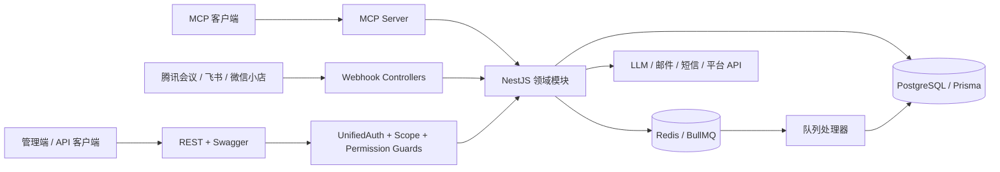

# 系统架构

Nove API 是一个 NestJS 单体应用，围绕身份与权限、组织管理、会议数据、AI 总结、订单和第三方集成组织领域模块。应用同时暴露 REST、GraphQL、MCP、Webhook 与运维入口，PostgreSQL 保存业务数据，Redis 支撑 BullMQ 队列。

## 运行时拓扑

```mermaid
flowchart LR
  Client[管理端 / API 客户端] --> REST[REST + Swagger]
  Agent[MCP 客户端] --> MCP[MCP Server]
  Vendor[腾讯会议 / 飞书 / 微信小店] --> Hook[Webhook Controllers]

  REST --> Guard[UnifiedAuth + Scope + Permission Guards]
  MCP --> App[NestJS 领域模块]
  Hook --> App
  Guard --> App

  App --> DB[(PostgreSQL / Prisma)]
  App --> Queue[(Redis / BullMQ)]
  Queue --> Worker[队列处理器]
  Worker --> DB
  App --> External[LLM / 邮件 / 短信 / 平台 API]
```

全局 `ValidationPipe` 开启 `whitelist`、`forbidNonWhitelisted` 和 `transform`。认证、Scope 与权限守卫在 `AppModule` 中以 `APP_GUARD` 注册；公开接口或只要求认证的接口必须使用项目装饰器显式声明。

## 主要边界

- **身份与授权**：`auth`、`api-key`、`oauth`、`role`、`permission`。
- **组织域**：`org`、`dept`、`org-member`、`user`、`user-platform`。
- **会议域**：`meeting` 负责会议、录制、转写和总结 CRUD；`meet-ai` 负责生成参会者与周期总结。
- **集成域**：`tencent-mtg`、`tencent-mtg-hook`、`lark-meeting`、`wechat-shop`。
- **基础能力**：`prisma`、`task`、`webhook-log`、`mail`、`sms`、`llm`、`admin/system-config`。

模块清单见[模块设计](./modules.md)，目录约定见[项目结构](./project-structure.md)，真实脚本以[命令说明](../development/package-scripts.md)为准。

## 本地入口

启动 `pnpm start:dev` 后可访问：

- Swagger UI：`http://localhost:3000/api`
- OpenAPI JSON：`http://localhost:3000/api-json`
- Redoc：`http://localhost:3000/docs`
- GraphQL：`http://localhost:3000/graphql`
- Bull Board：`http://localhost:3000/queues`（Basic Auth）

根路由 `/` 是当前应用健康响应；`/meet-ai/health` 用于 Meet AI 子域检查。
