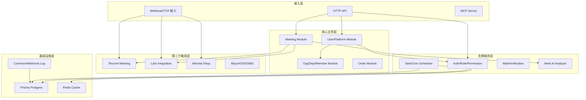

# 项目结构文档

本文档详细描述了 Nove API 系统的项目结构，包括目录组织、模块划分和开发流程。

## 目录结构概览

```
nove_api/
├── src/                           # 源代码目录
│   ├── auth/                      # 认证模块
│   ├── api-key/                   # API 密钥管理
│   ├── common/                    # 公共模块（拦截器、过滤器、工具类）
│   ├── configs/                   # 配置模块
│   ├── dept/                      # 部门架构
│   ├── integrations/              # 第三方集成基础服务（飞书等）
│   ├── lark-meeting/              # 飞书会议业务模块
│   ├── mail/                      # 邮件服务
│   ├── mcp-server/                # MCP 服务端集成
│   ├── meet-ai/                   # 会议 AI 分析
│   ├── meeting/                   # 会议数据核心模块
│   ├── order/                     # 订单模块
│   ├── org/                       # 组织（多租户）管理
│   ├── org-member/                # 组织成员管理
│   ├── permission/                # 权限管控点定义
│   ├── prisma/                    # 数据库连接层
│   ├── redis/                     # 缓存层
│   ├── role/                      # 角色与 RBAC 绑定
│   ├── task/                      # 后台与定时任务调度
│   ├── tencent-mtg/               # 腾讯会议开放 API 对接
│   ├── tencent-mtg-hook/          # 腾讯会议 Webhook 事件处理
│   ├── user/                      # 用户档案模块
│   ├── user-platform/             # 平台账号（三方绑定）管理
│   ├── verification/              # 验证码生成与校验
│   ├── webhook-log/               # 第三方 Webhook 调用日志
│   └── wechat-shop/               # 微信小店集成
├── prisma/                        # 数据库相关
│   ├── models/                    # 数据模型定义 (分文件管理的 Prisma schema)
│   ├── seeds/                     # 种子数据
│   ├── seed-utils/                # 种子脚本工具
│   ├── migrations/                # 数据库迁移文件
│   └── schema.prisma              # Prisma 主模式文件
├── docs/                          # 文档目录
│   ├── .vitepress/                # VitePress 站点配置
│   ├── developer/                 # 开发者技术文档
│   ├── user/                      # 用户/API 使用手册
│   └── public/                    # 静态资源
├── scripts/                       # 构建或运维脚本
└── test/                          # 全局测试配置
```

## 核心层级详解

本项目遵循 NestJS 典型的三层架构（Controller -> Service -> Repository），并在每个模块内保持高度一致的文件组织规范。

以一个标准模块（如 `auth`）为例，通常包含以下结构：
```
auth/
├── controllers/                   # HTTP请求处理层
├── services/                      # 业务逻辑层
├── repositories/                  # 数据库交互层
├── dto/                           # 数据传输对象 (输入校验与输出定义)
├── enums/                         # 枚举定义
├── types/                         # 类型与接口定义
├── guards/                        # 路由守卫 (鉴权拦截)
└── decorators/                    # 自定义装饰器
```

## 模块间关系

### 依赖关系图



## 命名约定

### 文件和目录命名
- **目录**: 使用 kebab-case (小写字母和连字符)，例如 `user-platform`
- **文件**: 使用 kebab-case 结合类型后缀，例如 `user.service.ts`, `auth.controller.ts`

### 代码命名
- **类名/DTO/接口**: 使用 PascalCase (大驼峰)，例如 `CreateUserDto`, `UserService`
- **方法和变量**: 使用 camelCase (小驼峰)，例如 `findByUnionId()`
- **常量**: 使用 UPPER_SNAKE_CASE，例如 `DEFAULT_PAGE_SIZE`

### 数据库命名 (Prisma)
- **Model名**: 使用 PascalCase 单数形式，例如 `User`, `MeetingUserAction`
- **字段名**: 使用 camelCase，例如 `userId`, `createdAt`
- *注：实际在 PostgreSQL 中生成的表名和列名，通过 `@map` 映射为了 `snake_case`。*

## 最佳实践与规范

1. **Prisma 拆分方案**: 由于表结构复杂，本项目采用了 Prisma 拆分管理方案。在 `prisma/models/` 目录下单独编辑模型，然后再通过脚本合并生成最终的 `schema.prisma`。**切勿直接修改根目录下的 `schema.prisma`**。
2. **DTO 验证**: 必须使用 `class-validator` 在 Controller 层拦截并校验所有输入数据。
3. **Repository 隔离**: 严禁在 Service 层直接调用 `PrismaService` 的读写方法，所有数据库操作必须封装在 Repository 内。
4. **长耗时操作**: 所有调用外部 API（如 LLM、大体积文件下载等）必须交由 `task` 模块进行异步处理或队列消费。