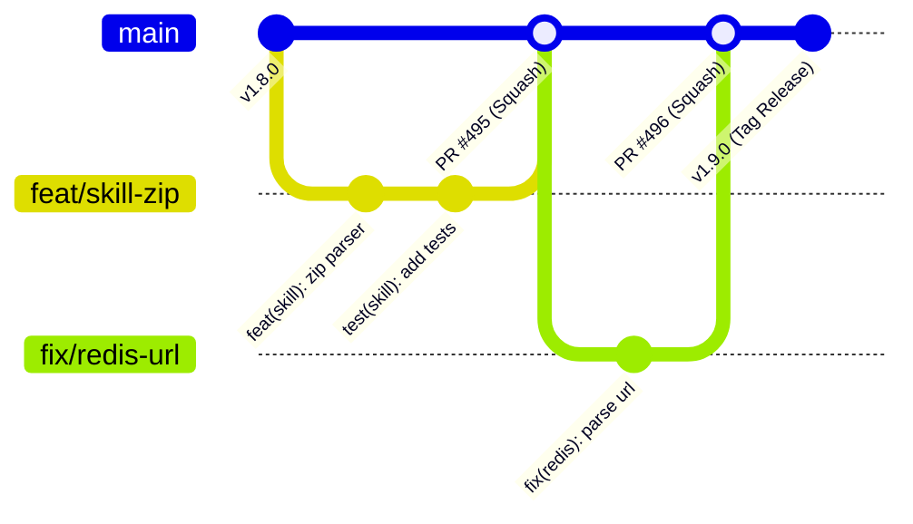
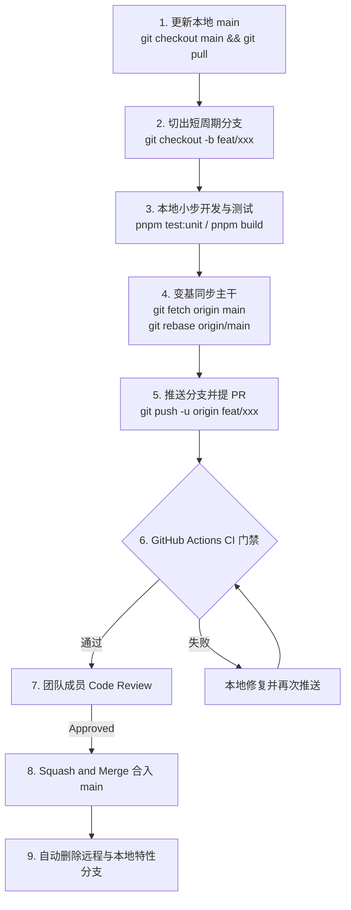
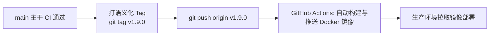

# 团队 Git 协作规范 (Trunk-Based Development)

> 本规范遵循业界主流的 **[Trunk-Based Development (主干开发)](https://trunkbaseddevelopment.com/)** 模式，旨在通过“唯一主干、短生命周期分支、小步快跑、强自动化 CI 门禁”实现快速迭代、消除合并地狱（Merge Hell）并保持生产随时可发布。

---

## 📋 目录

- [🌟 核心理念：主干开发 (TBD)](#-核心理念主干开发-tbd)
- [🌿 分支策略与命名规范](#-分支策略与命名规范)
- [🔄 标准工作流程 (Workflow)](#-标准工作流程-workflow)
- [✍️ 提交信息规范 (Conventional Commits)](#️-提交信息规范-conventional-commits)
- [🔀 Pull Request 规范与检查清单](#-pull-request-规范与检查清单)
- [👥 代码审查准则 (Code Review)](#-代码审查准则-code-review)
- [⚔️ 冲突解决流程 (Rebase-First)](#️-冲突解决流程-rebase-first)
- [🚀 发布流程 (Release from Trunk)](#-发布流程-release-from-trunk)
- [🤝 最佳实践与常见 FAQ](#-最佳实践与常见-faq)
- [📚 参考资源](#-参考资源)

---

## 🌟 核心理念：主干开发 (TBD)

传统的 GitFlow 模式依赖长期的 `develop` 与 `main` 双分支，往往导致庞大的特性分支长期偏离主线，最终引发灾难性的合并冲突与集成延迟。

Nove API 全面采用 **Trunk-Based Development**：



### 五大核心原则

1. **唯一长期主干 (Single Trunk)**：
   `main` 分支是项目**唯一长期存在**的可信代码源。仓库不再维护任何永久性的 `develop` 分支。
2. **短生命周期分支 (Short-Lived Branches)**：
   特性分支生命周期应极其短暂（**建议数小时至 1~2 天**），避免分支长期独立演化。
3. **小步快跑与频繁集成 (Small Batches)**：
   提倡小批量的代码变更（单个 PR 建议控制在 **400 行以内**）。大的功能应拆解为多个可独立测试的阶段性小 PR 连续合入。
4. **特性开关与半成品隔离 (Feature Toggles)**：
   如果功能尚未完全具备用户界面或完全跑通，可以通过特性开关、参数控制或私有路由提前合并到 `main`，而不是让分支在本地长期挂起。
5. **强大的自动化 CI 质量门禁 (Robust CI)**：
   每一次向 `main` 提交或发起 PR，GitHub Actions 将执行全套构建与测试，任何破坏主干的红构建必须获得第一优先级修复。

---

## 🌿 分支策略与命名规范

### 1. 分支类型

| 分支类型 | 命名格式 | 用途 | 生命周期 |
|---|---|---|---|
| **主干分支 (Trunk)** | `main` | 生产与日常开发集成的唯一主干，始终处于随时可发布状态 | 永久存在（受保护） |
| **特性开发分支** | `feat/<description>` | 新功能开发，从 `main` 切出，通过 PR 合入 `main` | 临时（几小时 ~ 2天） |
| **缺陷修复分支** | `fix/<description>` | Bug 修复 | 临时（当日解决） |
| **架构重构分支** | `refactor/<description>` | 代码与目录结构重构，不改变对外业务表现 | 临时 |
| **文档与规范** | `docs/<description>` | 文档补充、OpenAPI / ReDoc 描述更新 | 临时 |
| **构建与工具** | `chore/<description>` | 依赖升级、配置文件、测试夹具调整 | 临时 |
| **CI 流水线** | `ci/<description>` | GitHub Actions 工作流调整 | 临时 |
| **发布分支 (可选)** | `release/vX.Y` | 仅在重大版本准备独立发布冻结窗口时从 `main` 临时拉出 | 临时（发版后归档） |

### 2. 命名示例

```bash
# 特性开发
feat/zip-skill-version-management
feat/organization-logo-profile
feat/data-rule-actions-api

# 缺陷修复
fix/redis-url-connection-configuration
fix/auto-generate-project-slugs
fix/lark-integration-org-context

# 重构与文档
refactor/storage-domain-organization-profile
docs/redoc-navigation-theme
chore/guard-test-database
```

> [!IMPORTANT] 分支保护规则
> - `main` 分支在 GitHub 上开启严格保护：禁止任何用户（包括管理员）直接 `git push origin main`。
> - 必须通过 Pull Request 提交合入，且至少满足：
>   1. GitHub Actions CI 检查通过（Postgres + Redis 容器、Prisma 生成与校验、Lint、Build、Unit Test 全通过）。
>   2. 至少 1 位团队成员 Code Review 批准 (Approved)。

---

## 🔄 标准工作流程 (Workflow)



### 详细步骤

#### 第一步：基于最新主干创建分支
确保你本地的 `main` 分支是最新状态：

```bash
git checkout main
git pull origin main
git checkout -b feat/user-security-audit
```

#### 第二步：小步提交
在本地开发时，保持提交小而清晰，严格遵循 [Conventional Commits](#️-提交信息规范-conventional-commits)：

```bash
git add src/auth/
git commit -m "feat(auth): log contact change events to security audit table"
```

#### 第三步：频繁同步主干 (Rebase-First)
在开发期间或发起 PR 前，随时拉取主干的最新进展，使用 `rebase` 保证提交历史的线性整洁：

```bash
git fetch origin main
git rebase origin/main
```

#### 第四步：推送并创建 Pull Request
将分支推送到远程仓库并创建指向 `main` 的 PR：

```bash
git push -u origin feat/user-security-audit
```

在 GitHub 上填写 PR 描述，指明变更动机、测试情况及关联的 Issue。

#### 第五步：自动化 CI 运行与代码审查
PR 触发 Actions 流水线，等待机器人报告结果，由团队同事审查代码并提出建议。

#### 第六步：Squash and Merge 合入主干
审查通过后，采用 **Squash and Merge** 模式合并。合并提交信息应包含标准的语义化前缀及 PR 编号（如 `feat(auth): log contact change events (#498)`）。

#### 第七步：清理分支与回到主干
合并完成后，GitHub 会自动提示删除远程分支。本地清理命令：

```bash
git checkout main
git pull origin main
git branch -d feat/user-security-audit
git remote prune origin
```

---

## ✍️ 提交信息规范 (Conventional Commits)

本项目严格执行 [Conventional Commits](https://www.conventionalcommits.org/) 规范。

### 1. 结构格式

```text
<type>(<scope>): <subject>

[optional body]

[optional footer(s)]
```

### 2. Type 说明

| Type | 语义 | 示例 |
|---|---|---|
| **feat** | 新增业务功能或 API | `feat(skill): manage immutable Zip skill versions` |
| **fix** | 缺陷与 Bug 修复 | `fix(project): generate slugs when omitted (#497)` |
| **refactor** | 代码重构（不影响外部表现） | `refactor(redis): use URL configuration for cache and queues` |
| **docs** | 文档新增或修改 | `docs(api): group and restyle ReDoc navigation` |
| **test** | 测试用例新增或调整 | `test: guard database-backed test suites (#496)` |
| **chore** | 构建流程、开发工具或依赖更新 | `chore(test): support local environment fallback` |
| **ci** | GitHub Actions 流水线调整 | `ci: align workflow triggers with main branch` |
| **perf** | 性能优化 | `perf(minute): optimize transcript segment batch queries` |

### 3. Scope 说明 (模块作用域)

可选但强烈推荐填写，通常对应领域模块目录名，例如：
`auth`、`permission`、`org`、`meeting`、`minute`、`skill`、`project`、`order`、`tmeet`、`lark`、`wecom`、`redis`、`prisma`、`docs` 等。

### 4. 正反范例

#### ✅ 优质提交
```bash
feat(skill): import skill zip packages and validate manifest schema
fix(order): allow updating order benefits with null owner
refactor(storage): move organization profile logic into org domain
docs(integrations): align service configuration and deployment guidance
```

#### ❌ 不合格提交
```bash
fix bug                  # 缺少上下文和领域
update files             # 毫无信息量
feat: add everything     # 提交粒度过大
temp work                # 严禁将临时调试提交推送到远程
```

---

## 🔀 Pull Request 规范与检查清单

### 1. PR 大小控制
- **黄金标准**：PR 变更通常应控制在 **400 行以内**（不含 lockfile 或自动生成的代码）。
- **拆分策略**：如果一个大功能需要 2000 行代码，应拆分为：
  - PR 1: 数据库 Schema 迁移与 Repository 封装
  - PR 2: 核心 Service 业务编排与单元测试
  - PR 3: Controller 端点暴露与 Swagger 文档

### 2. PR 描述模板

```markdown
## 📝 变更说明
简要说明本次 PR 的背景、解决的问题及实现方案。

## 🎯 变更类型
- [ ] 🚀 新特性 (feat)
- [ ] 🐛 Bug 修复 (fix)
- [ ] ♻️ 重构 (refactor)
- [ ] 📖 文档更新 (docs)
- [ ] 🔧 构建或配置 (chore/ci)

## 🧪 验证方式
- [ ] 本地单元测试通过 (`pnpm test:unit`)
- [ ] 本地构建通过 (`pnpm build`)
- [ ] 文档死链检查通过 (`pnpm docs:build`)

## 🔗 关联 Issue / PR
Closes #xxx
```

---

## 👥 代码审查准则 (Code Review)

代码审查的目的是保障系统稳定性、促进知识共享并保持架构一致性。

### 审查检查要点

1. **业务与架构**：
   - 是否破坏了现有的领域边界？控制器是否直接穿透到仓储层？
   - 是否正确应用了组织隔离 (`orgId`)？
2. **安全性与凭据**：
   - 绝不允许任何明文 Secret、Password 出现在代码或日志中。
   - 外部入参是否通过 DTO 与 `class-validator` 进行了严格校验？
3. **测试覆盖**：
   - 核心业务改动是否包含对应的 `*.spec.ts` 单元测试？
4. **性能与异常**：
   - 是否存在循环查询数据库（N+1 问题）？
   - 异步耗时操作（如视频文件下载、大模型调用）是否合理通过 BullMQ 解耦？

---

## ⚔️ 冲突解决流程 (Rebase-First)

在主干开发模式下，冲突应尽早在本地通过 **Rebase** 解决，绝不在特性分支中充斥无意义的 `Merge branch 'main' into feat/xxx` 提交记录。

### 解决步骤

```bash
# 1. 确保本地处于自己的工作分支
git checkout feat/my-feature

# 2. 拉取远程最新的 main
git fetch origin main

# 3. 在主干之上变基
git rebase origin/main
```

如果遇到冲突：

```bash
# 4. 查看冲突文件
git status

# 5. 在编辑器中手动解决冲突，保留正确的代码

# 6. 将解决后的文件加入暂存区并继续变基
git add <conflict-file.ts>
git rebase --continue

# 7. 解决所有冲突后，强制推送到远程特性分支（仅自身拥有的分支允许 -f）
git push -f origin feat/my-feature
```

---

## 🚀 发布流程 (Release from Trunk)

在主干开发模式下，发布直接从主干拉取版本（**Release from Trunk**）：



### 1. 主干打 Tag 直接发布 (主流方式)

当 `main` 主干累积了若干新特性且全套 CI 测试绿灯时：

```bash
# 1. 确保本地 main 干净且与远程完全同步
git checkout main
git pull origin main

# 2. 本地执行全量门禁预检
pnpm build
pnpm test:unit
pnpm docs:build

# 3. 创建语义化 Tag 并推送到远程
git tag -a v1.9.0 -m "release: v1.9.0 - Support Zip Skill versioning and Project isolation"
git push origin v1.9.0
```

GitHub Actions `docker.yml` 捕获到 Tag 推送后，将自动构建多阶段生产镜像 `noveapi:1.9.0` 并打上对应标签推送到镜像仓库。

### 2. 紧急修复 (Hotfix on Trunk)

如果生产环境发现 Bug：
1. 从 `main` 切出 `fix/critical-bug` 分支。
2. 修复代码、补齐测试用例，发起紧急 PR 合并入 `main`。
3. 在 `main` 上打出小版本 Tag（如 `v1.9.1`），自动触发重新构建与上线。

---

## 🤝 最佳实践与常见 FAQ

### 1. 为什么不再使用 `git pull` 直接 merge？
直接使用 `git pull` 默认会在本地产生分叉和多余的 Merge 提交。建议配置 Git 默认使用变基：
```bash
git config --global pull.rebase true
```

### 2. 本地提交信息写错了如何修改？
若尚未推送到远程：
```bash
git commit --amend -m "feat(correct-scope): your new message"
```

### 3. 不小心在 `main` 分支进行了本地提交怎么办？
```bash
# 1. 从当前提交切出一个新的特性分支
git branch feat/my-work

# 2. 将本地 main 重置回远程一致的状态
git reset --hard origin/main

# 3. 切换到新的特性分支继续工作
git checkout feat/my-work
```

### 4. 特性开发周期长于预期怎么办？
如果某项大特性需要 1 周以上：
- **切忌**建立一个挂起长达一周的“巨型分支”。
- **应该**按功能切片拆解：将底层实体、DTO、基础 Service 分批次合入 `main`（尚未对用户暴露的代码安全无害）；利用特性开关（Feature Flag）屏蔽尚未就绪的前端或控制器入口。

---

## 📚 参考资源

- 📖 **[Trunk-Based Development 官方指南](https://trunkbaseddevelopment.com/)**
- 规范 **[Conventional Commits 1.0.0](https://www.conventionalcommits.org/)**
- 文档 **[版本号与 Tag 对照表](./version-control.md)**
- 脚本 **[Package 脚本指南](./scripts.md)**
