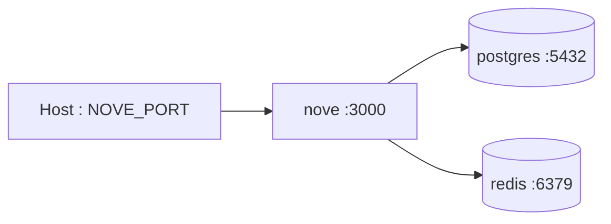

# 部署概览

仓库提供多阶段 `Dockerfile` 和 `docker-compose.yml`。生产镜像使用 Node 22 Alpine，以非 root 的 `node` 用户运行；Compose 同时启动 Nove API、PostgreSQL 17.5 和 Redis 8.2，并为数据库服务配置持久卷与健康检查。

## 本地容器拓扑



Compose 默认从根 `.env` 注入配置。至少确认 `POSTGRES_PASSWORD`、`REDIS_PASSWORD`、`DATABASE_URL`、Redis 连接参数、JWT 密钥和外部集成密钥；不要把真实值提交到仓库。

## 构建与启动

```bash
# 构建应用镜像
docker build -t noveapi:local .

# .env 中可覆盖 NOVE_IMAGE、NOVE_PORT 等变量
docker compose up -d

# 查看服务状态和 API 日志
docker compose ps
docker compose logs -f nove
```

镜像构建阶段执行 `pnpm db:generate` 和 `pnpm build`。应用启动命令为 `node dist/src/main.js`；不要沿用旧文档中的 Node 18 或 `dist/main.js` 容器路径。

## 数据库迁移

迁移应作为独立部署步骤，在新应用实例接收流量前执行：

```bash
pnpm db:migrate:prod
```

生产环境不要运行 `db:push`、`db:migrate`（dev）或 `db:reset`。种子数据不是每次部署的默认步骤，仅在明确需要并确认幂等性后执行。

## CI 基线

`.github/workflows/ci.yml` 在 `develop` push 及 `develop`/`main` PR 上运行，使用 Node 20、pnpm 9、PostgreSQL 15 和 Redis 7，依次执行依赖安装、Prisma Client 生成、lint、Prisma 校验/迁移、构建与单元测试。部署流水线应至少复用这些门禁，并额外执行 `pnpm docs:build` 以保护文档链接。

更完整的环境变量、反向代理和发布检查见[部署指南](./guide.md)。
