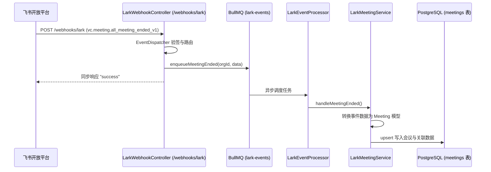

# 飞书集成 (Lark Integration)

Nove API 集成了飞书开放平台（Lark Open Platform），主要负责监听飞书视频会议（VC）事件、自动同步会议录制文件与元数据，并通过 BullMQ 队列实现高可靠的异步削峰与落库。

> [!NOTE] 架构演进说明
> 历史版本中的飞书多维表格（Bitable）数据同步已在 PR #426 中全面下线与解耦。当前的飞书模块完全聚焦于**视频会议 (VC) 协同、事件监听与云录制同步**。

## 核心能力

- ✅ **会议生命周期监听**：订阅全员离会事件（`vc.meeting.all_meeting_ended_v1`），捕获会议时长、参会人及会议基础信息。
- ✅ **云录制文件拉取**：调用飞书 VC OpenAPI (`client.vc.v1.meetingRecording.get`) 获取会议录制文件及下载地址。
- ✅ **异步解耦架构**：通过 BullMQ `lark-events` 队列缓冲突发会议事件，由工作进程异步消费处理。
- ✅ **双通道事件接收**：同时支持 HTTP Webhook 回调接收与 WebSocket 长连接（`LarkWsEventListener`）监听。

## 项目结构

飞书相关实现统一组织在 `src/lark/`：

```text
src/lark/
├── client/                     # 基于 @larksuiteoapi/node-sdk 的客户端封装
│   └── lark.client.ts
├── controllers/
│   └── webhook.controller.ts   # Webhook 回调入口 (/webhooks/lark)
├── adapter/                    # Express 与飞书 SDK 原生 Request/Response 适配
├── queue/
│   └── lark-event.processor.ts # BullMQ 队列消费者 (lark-events)
├── services/
│   ├── lark-meeting.service.ts # 会议事件入队与业务落库处理
│   └── meeting-recording.service.ts # VC 录制文件拉取服务
├── listeners/
│   └── lark-ws-event.listener.ts # WebSocket 长连接事件监听器
├── enums/                      # 飞书事件类型与枚举定义
└── lark.module.ts              # 模块装配
```

## 服务凭据配置

飞书的凭据已收拢至 **Nove Admin 管理后台「服务集成 → 飞书」** 中进行动态加密维护：

| 配置项 | 说明 |
|---|---|
| `appId` | 飞书开放平台企业自建应用的 App ID (`cli_xxx`) |
| `appSecret` | 应用密钥 (App Secret，加密存储) |
| `eventEncryptKey` | 事件订阅的消息加解密 Key (Encrypt Key，可选) |
| `eventVerificationToken` | 事件订阅的验证 Token (Verification Token) |

后台保存后通过事件机制实时热更新至 `IntegrationsService`，无需重启后端服务。

## 事件处理链路



详细 Webhook 配置步骤与字段说明参见 [Lark Webhook 集成指南](./webhook.md)。
