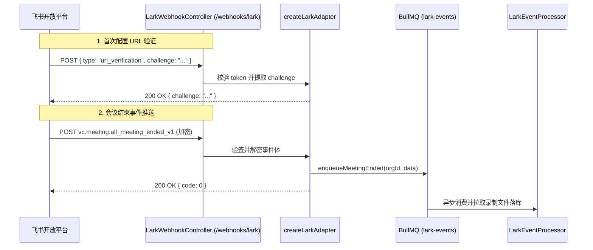

# 飞书 Webhook 集成指南

本文档说明如何在项目中配置和接入飞书（Lark）开放平台的 Webhook 事件推送，实现会议生命周期事件的实时接收与异步处理。

## 功能特性

- ✅ 基于飞书官方 Node.js SDK (`@larksuiteoapi/node-sdk`) 的 `EventDispatcher`
- ✅ 支持消息签名验证与 AES 加密消息体自动解密
- ✅ 自动响应飞书开放平台的 URL 验证 Challenge 请求 (`autoChallenge: true`)
- ✅ 接收会议结束事件 (`vc.meeting.all_meeting_ended_v1`) 并自动入队 BullMQ
- ✅ 统一收拢至管理后台「服务集成」动态管理凭据与热更新

---

## Webhook 端点与配置

### 1. Webhook 地址

在飞书开放平台「事件订阅」中配置请求网址 (URL)：

```text
POST https://your-domain.com/webhooks/lark
```

> [!NOTE] 统一端点
> 本项目采用单个统一的 `POST /webhooks/lark` 端点，同时处理飞书平台的 URL 挑战验证 (Challenge) 与实际业务事件推送，无需区分 `/event` 或 `/verify` 子路径。

### 2. 服务集成凭据配置

飞书 Webhook 校验与解密凭据无需在 `.env` 中声明，已统一在 **Nove Admin 管理后台「服务集成 → 飞书」** 中加密维护：

| 配置字段 | 飞书开放平台对应项 | 说明 |
|---|---|---|
| `eventVerificationToken` | Verification Token | 用于验证事件请求确实来自飞书平台 |
| `eventEncryptKey` | Encrypt Key | 用于 AES 解密事件消息体（如果在平台开启了加密） |

保存后自动加密写入数据库并进行进程内热重载，即时生效。

---

## 订阅事件配置

在飞书开放平台「应用详情 → 事件与回调 → 事件配置」中添加以下事件订阅：

| 事件名称 | 事件标识 | 说明 |
|---|---|---|
| **全部参会人离会** | `vc.meeting.all_meeting_ended_v1` | 当一场视频会议所有成员离会、会议结束时触发 |

---

## 处理逻辑与架构

控制器源码位于 [`src/lark/controllers/webhook.controller.ts`](file:///Users/yangshiming/code/nove_project/nove-api/src/lark/controllers/webhook.controller.ts)：



---

## 本地测试与联调

1. **本地启动服务**：
   ```bash
   pnpm start:dev
   ```

2. **验证 Challenge 响应**：
   使用 curl 模拟飞书 URL 验证请求：
   ```bash
   curl -X POST http://localhost:3000/webhooks/lark \
     -H 'Content-Type: application/json' \
     -d '{
       "type": "url_verification",
       "token": "<your-verification-token>",
       "challenge": "test_challenge_code"
     }'
   ```
   预期响应：
   ```json
   {"challenge":"test_challenge_code"}
   ```

3. **外网映射联调**：
   本地联调可使用穿透工具（如 ngrok 或 Cloudflare Tunnel），将公网域名映射到本地 `3000` 端口，并在飞书开放平台测试事件推送。

---

## 常见排障

1. **URL 配置时提示“请求网址校验失败”**：
   - 检查管理后台「服务集成 → 飞书」填写的 `eventVerificationToken` 与开放平台是否完全一致。
   - 检查服务器防火墙或反向代理是否拦截了 POST 请求。
2. **事件推送未入库**：
   - 检查 `webhook_logs` 表排查是否有签名错误记录。
   - 访问 `/queues`（Bull Board）检查 `lark-events` 队列是否有堆积或 Failed 任务。
