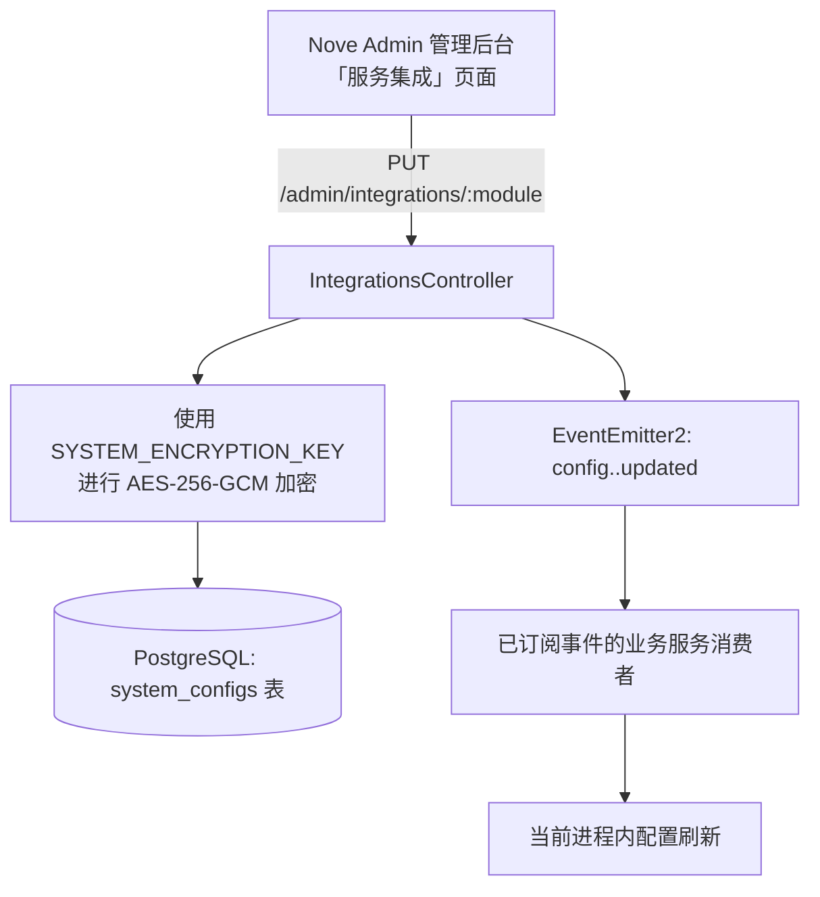

# 管理后台服务集成指南 (Service Integrations)

Nove API 将大部分第三方业务服务配置统一收拢至 **Nove Admin 管理后台「服务集成」** 中进行动态管理、加密存储与运行时热更新。

::: tip 架构说明
集成注册表中的业务配置通过管理后台维护，敏感字段加密存储；已接入更新事件的消费者支持进程内刷新。系统基础设施变量（PostgreSQL、Redis、JWT Secret、以及用于加密凭据的主密钥 `SYSTEM_ENCRYPTION_KEY`）仍由环境变量注入。阿里云文件扫描的访问凭证仍通过服务端 `@alicloud/credentials` 凭证链获取，扫描参数在后台维护。
:::

---

## 一、集成架构与生效机制



### 1. 配置生效优先级
配置加载遵循：
$$\text{代码默认值 (兜底)} \to \text{数据库加密存储值 (最高优)}$$

### 2. 安全与脱敏契约
- **加密存储**：所有敏感字段（API Key、Secret、密码、Webhook Token、AES Key 等）在写入 `system_configs` 前，均经由 `SYSTEM_ENCRYPTION_KEY` 采用 AES-256-GCM 算法加密。
- **只读脱敏**：通过 API 或管理后台读取配置时，敏感字段统一显示为掩码 `********`。
- **增量更新**：提交保存时，若敏感字段内容为 `********` 或空字符串，系统将自动保留已有密文，不会覆盖为空。

---

## 二、服务集成配置清单与字段参考

下表中的“必填”表示模块被判定为已配置时需要的字段；PUT 支持增量更新，无需每次提交全部字段。字段及默认值以 `src/admin/integrations/definitions` 为准。

### 1. AI 模型服务 (`ai`)
用于集成大语言模型，支持会议纪要总结、参会者总结、智能待办提取与问答交互。

| 字段名 | 类型 | 必填 | 默认值 / 选项 | 说明 |
| :--- | :--- | :--- | :--- | :--- |
| `provider` | string | 否 | `ark` \| `openai` \| `custom` | 服务提供商（字节火山引擎方舟、OpenAI 官方或自定义兼容服务） |
| `baseUrl` | string | 是 | - | API Base URL（如 `https://ark.cn-beijing.volces.com/api/v3` 或 `https://api.openai.com/v1`） |
| `apiKey` | string | 是 (敏感) | - | 对应平台 API 访问密钥 (API Key) |
| `model` | string | 是 | - | 模型名称或 Endpoint ID（如 `ep-202412...` 或 `gpt-4o`） |
| `maxTokens` | number | 否 | `16000` | 单次请求最大 Token 数上限（最小 1） |
| `temperature` | number | 否 | `0.7` | 采样温度参数（`0` ~ `2`，控制输出随机性） |

---

### 2. 文件扫描服务 (`file-scanning`)
用于云盘上传文件及会议文件的恶意代码与病毒扫描。选择 `ALIYUN_SAS` 时，还需配置服务端阿里云凭证链（例如 RAM 角色或 `ALIBABA_CLOUD_ACCESS_KEY_ID` / `ALIBABA_CLOUD_ACCESS_KEY_SECRET`）；本模块不存储扫描服务的访问密钥。

| 字段名 | 类型 | 必填 | 默认值 / 选项 | 说明 |
| :--- | :--- | :--- | :--- | :--- |
| `malwareScanProvider` | string | 否 | `ALIYUN_SAS` \| `CLAMAV` | 扫描引擎：`ALIYUN_SAS`（阿里云云安全中心，生产推荐）或 `CLAMAV`（本地/独立扫描节点） |
| `aliyunSasRegionId` | string | 否 | `cn-beijing` | 阿里云云安全中心所属地域 ID |
| `scanTimeoutMs` | number | 否 | `300000` (5分钟) | 阿里云异步文件检测最大超时时间（毫秒，30000 ~ 1800000） |
| `scanPollIntervalMs` | number | 否 | `3000` (3秒) | 轮询阿里云检测结果间隔（毫秒，1000 ~ 30000） |
| `clamAvHost` | string | 否 | - | ClamAV 守护进程 (`clamd`) 主机地址（如 `127.0.0.1` 或 `clamav`） |
| `clamAvPort` | number | 否 | `3310` | ClamAV 服务端口（1 ~ 65535） |
| `clamAvTimeoutMs` | number | 否 | `600000` (10分钟) | ClamAV 流式传输与扫描超时时间（毫秒） |

---

### 3. SMTP 邮件服务 (`mail`)
用于发送系统通知邮件（用户注册验证码、密码重置、会议邀请与提醒等），并支持全局邮件品牌外观配置。

| 字段名 | 类型 | 必填 | 默认值 | 说明 |
| :--- | :--- | :--- | :--- | :--- |
| `host` | string | 是 | `smtp.gmail.com` | SMTP 服务器地址（如 `smtp.feishu.cn`, `smtp.exmail.qq.com`） |
| `port` | number | 是 | `587` | SMTP 服务器端口（`465` SSL / `587` STARTTLS） |
| `secure` | boolean | 否 | `false` | 是否使用 SSL/TLS 直连加密（465 端口填 `true`，587 端口填 `false`） |
| `user` | string | 是 | - | 发信邮箱账号 |
| `pass` | string | 是 (敏感) | - | 发信邮箱应用密码或专用授权码（**注意非登录密码**） |
| `from` | string | 是 | - | 发件人地址（通常与 `user` 保持一致，如 `Nove <noreply@example.com>`） |
| `brandName` | string | 否 | `Nove System` | 邮件顶部与正文展示的系统品牌名称 |
| `brandLogoUrl` | string | 否 | - | 邮件顶部 Logo 图片公网访问 URL |
| `brandPrimaryColor` | string | 否 | `#2563eb` | 邮件按钮与重点高亮主题色（十六进制颜色值，如 `#2563eb`） |
| `brandFooterText` | string | 否 | `此邮件由 Nove System 自动发送，请勿回复。` | 邮件页脚版权与说明文字 |
| `brandPublicBaseUrl` | string | 否 | - | 邮件正文跳转的站点公开访问 Base URL |

---

### 4. 腾讯会议 (`tencent-meeting`)
用于集成腾讯会议开放平台，实现会议创建、修改、取消、云录制事件订阅及会议纪要转写拉取。

| 字段名 | 类型 | 必填 | 敏感 | 说明 |
| :--- | :--- | :--- | :--- | :--- |
| `appId` | string | 是 | 否 | 腾讯会议应用 ID（在开放平台创建自建应用获取） |
| `sdkId` | string | 是 | 否 | 腾讯会议 SDK ID（用于客户端集成与 API 身份验证） |
| `secretId` | string | 是 | 是 | 腾讯会议 API 签名 Secret ID |
| `secretKey` | string | 是 | 是 | 腾讯会议 API 签名 Secret Key |
| `userId` | string | 是 | 否 | 腾讯会议默认操作者 User ID |
| `webhookToken` | string | 否 | 是 | 接收并校验腾讯会议 Webhook 回调的 Token |
| `encodingAesKey` | string | 否 | 是 | Webhook 消息解密 AES Key（43 位字符） |

> **获取方式**：登录 [腾讯会议开放平台](https://meeting.tencent.com/open-api)，在「应用管理」中创建自建应用并配置事件订阅。

---

### 5. 飞书开放平台 (`lark`)
用于飞书应用凭证配置、企业事件订阅长连接与 Webhook 验签回调。

| 字段名 | 类型 | 必填 | 敏感 | 说明 |
| :--- | :--- | :--- | :--- | :--- |
| `appId` | string | 是 | 否 | 飞书自建应用 AppID（开发者后台 → 凭证与基础信息） |
| `appSecret` | string | 是 | 是 | 飞书自建应用 AppSecret |
| `eventEncryptKey` | string | 否 | 是 | 事件订阅 Encrypt Key（开发者后台 → 事件与回调 → 加密策略） |
| `eventVerificationToken` | string | 否 | 是 | 事件订阅 Verification Token（开发者后台 → 事件与回调） |

> **获取方式**：登录 [飞书开放平台](https://open.feishu.cn/)。注意：若更新 `appId` 或 `appSecret`，HTTP 客户端立即生效；若使用了 WebSocket 长连接，需重启服务进程。

---

### 6. 企业微信 (`wecom`)
用于企业微信通讯录同步、客户联系及 Webhook 回调事件接收。

| 字段名 | 类型 | 必填 | 默认值 | 说明 |
| :--- | :--- | :--- | :--- | :--- |
| `corpId` | string | 是 | - | 企业微信企业 ID（企业微信管理后台 → 我的企业） |
| `corpSecret` | string | 是 (敏感) | - | 自建应用 Secret（应用管理 → 自建应用） |
| `webhookToken` | string | 否 (敏感) | - | 回调 URL 校验 Token |
| `encodingAesKey` | string | 否 (敏感) | - | 消息加解密密钥 (EncodingAESKey) |
| `apiBaseUrl` | string | 否 | `https://qyapi.weixin.qq.com` | 企微 API 网关地址 |

---

### 7. 微信小店 (`wechat-shop`)
用于微信小店（视频号小店）历史订单拉取、订单详情查询与售后同步。

| 字段名 | 类型 | 必填 | 默认值 | 说明 |
| :--- | :--- | :--- | :--- | :--- |
| `appId` | string | 是 | - | 微信小店应用 AppID |
| `appSecret` | string | 是 (敏感) | - | 微信小店应用密钥 AppSecret |
| `webhookToken` | string | 否 (敏感) | - | 回调验证 Token |
| `encodingAesKey` | string | 否 (敏感) | - | 消息加解密密钥 |
| `apiBaseUrl` | string | 否 | `https://api.weixin.qq.com` | 微信 API 基础服务地址 |

---

### 8. 对象存储服务 (`storage`)
用于头像图片、云盘文件与核心附件的私有存储、公开静态加速与限时安全签名访问（替代原 `.env` 中的 `ALIBABA_CLOUD_ACCESS_KEY_*` 与 `ALIYUN_OSS_*`）。

| 字段名 | 类型 | 必填 | 默认值 | 说明 |
| :--- | :--- | :--- | :--- | :--- |
| `provider` | string | 否 | `OSS` | DTO 接受 `OSS`、`COS`、`S3`、`LOCAL`；当前运行时绑定阿里云 OSS 实现，其他枚举值不代表已有对应存储适配器 |
| `region` | string | 否 | `oss-cn-hangzhou` | 存储桶所属地域 ID（如 `oss-cn-hangzhou`） |
| `bucket` | string | 是 | - | 私有存储桶名称 (Bucket)，用于云盘文件与核心资产 |
| `publicBucket` | string | 否 | - | 公共媒体存储桶 (Public Bucket，可选)，用于头像等公开静态资源；留空表示复用私有存储桶 |
| `accessKeyId` | string | 是 | - | 云存储访问密钥 AccessKey ID |
| `accessKeySecret` | string | 是 (敏感) | - | 云存储访问密钥 AccessKey Secret |
| `publicBaseUrl` | string | 否 | - | 公开资源访问 Base URL（如 CDN 加速域名或 Bucket 外网域名，末尾不带斜杠） |
| `signedUrlExpiresSeconds` | number | 否 | `600` | 临时安全签名 URL 有效期（秒，允许 60 ~ 3600 秒） |

---

### 9. 阿里云短信 (`aliyun-sms`)
用于国内手机验证码发送、密码找回及手机号安全换绑。

| 字段名 | 类型 | 必填 | 敏感 | 说明 |
| :--- | :--- | :--- | :--- | :--- |
| `accessKeyId` | string | 是 | 是 | 阿里云 RAM 账号 AccessKey ID |
| `accessKeySecret` | string | 是 | 是 | 阿里云 RAM 账号 AccessKey Secret |
| `signName` | string | 是 | 否 | 阿里云短信控制台审核通过的短信签名名称 |
| `verificationTemplateCode` | string | 是 | 否 | 验证码模版 CODE（如 `SMS_123456789`） |
| `securityChangeTemplateCode` | string | 是 | 否 | 安全变更通知模版 CODE（如 `SMS_987654321`） |

---

### 10. 扩展服务集成概览

除上述模块外，系统注册表（`IntegrationRegistry`）还支持以下集成模块：

| 模块标识 (`:module`) | 对应服务 | 主要用途 | 核心参数示例 |
| :--- | :--- | :--- | :--- |
| `stripe` | Stripe 支付 | 全球在线订阅与支付 | `secretKey`, `webhookSecret`, `publishableKey` |
| `drive` | 云盘系统 | 下载链接有效期、回收站保留期及分类上传大小限制 | `downloadUrlExpiresSeconds`, `recycleRetentionDays`, `imageMaxMiB`, `documentMaxMiB`, `audioMaxMiB`, `videoMaxMiB` |

---

## 三、管理后台 API 接口参考

服务集成的标准 REST API 统一挂载于 `/admin/integrations`。读取需要 `system:config:read`，保存、删除和测试需要 `system:config:write`；组织上下文由 `@CurrentOrg()` 提供。

```http
# 获取所有集成模块的配置状态概览
GET /admin/integrations

# 获取指定模块的有效配置（敏感字段脱敏为 ********）
GET /admin/integrations/:module

# 更新指定模块的配置（合并保存并加密入库，广播热更新事件）
PUT /admin/integrations/:module

# 删除指定模块的数据库配置（退回代码默认值）
DELETE /admin/integrations/:module

# 测试连接（将草稿与当前配置合并，不保存草稿）
POST /admin/integrations/:module/test
```

测试接口仅支持已注册测试提供方的模块；当前 `drive` 和 `file-scanning` 未注册。测试会调用外部服务，其中阿里云短信测试会实际发送短信，需额外提交 `testCountryCode` 和 `testPhoneNumber`。

---

## 四、常见问题解答 (FAQ)

### Q1：为什么 `.env.example` 中不再包含这些配置？
> 环境变量属于构建/部署阶段注入的静态配置，一旦修改需要重启 Pod/进程，且容易在容器编排或日志中意外泄露敏感密钥。将第三方凭证收拢到数据库管理后台后：
> 1. 管理员可在界面上直接调整并即时验证连接连通性；
> 2. 具备数据库级 AES-256-GCM 强加密和脱敏保护；
> 3. 配置记录按 `orgId` 存储和查询；使用 `SingleOrgContextService` 的常驻客户端按部署组织加载配置，不能仅凭配置表结构推断任意多租户运行能力。

### Q2：修改配置后需要重启服务吗？
> 已订阅 `config.<module>.updated` 事件的消费者会刷新当前进程的配置。飞书 WebSocket 长连接在更换应用凭证后需重启服务以重建连接。EventEmitter2 事件不会跨进程广播，多实例部署需逐实例重启以确保配置一致；环境变量变更也需重启。
