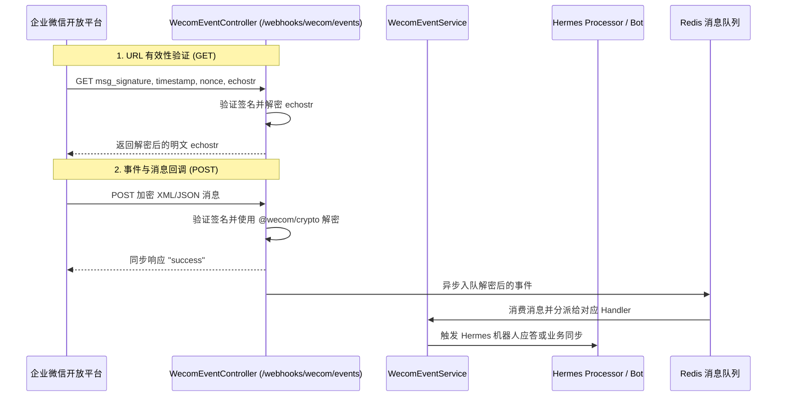

# 企业微信集成与 Hermes 通信机制

`WecomModule` (`src/wecom`) 提供了 Nove API 与企业微信（WeCom）生态的双向通信能力，支持事件接收、Hermes 机器人消息推送以及群聊协同。

## 核心架构与通信流程

## 配置机制

企业微信凭据统一收拢至 **Nove Admin 管理后台「服务集成 → 企业微信」** 统一动态加密配置：

- `corpId`：企业微信的企业 ID (CorpID)
- `webhookToken`：用于回调签名验证的 Token
- `encodingAesKey`：用于消息体加解密的 EncodingAESKey（43 位字符）

配置通过管理后台写入并由 `SYSTEM_ENCRYPTION_KEY` 加密，控制器通过 `IntegrationsService.getEffectiveConfig()` 动态读取。

## Webhook 端点

端点为 `/webhooks/wecom/events`：

1. **URL 验证 (GET)**：
   - 企微后台配置回调地址时由平台自动发起。
   - 携带 `msg_signature`、`timestamp`、`nonce`、`echostr` 参数。
2. **事件接收 (POST)**：
   - 接收用户与机器人私聊、群聊 @机器人、打卡及成员变更等各类企微事件。
   - 使用 `@wecom/crypto` 的 AES-CBC 模式解密消息体。

## Hermes 机器人机制

Hermes 是 Nove 平台接入企业微信的智能协同网关：
- 支持通过应用消息接口向指定企微成员推送会议总结、待办提醒与审核通知。
- 允许企业成员在企微群或单聊中直接向 Hermes 提问，底层通过 LLM + MCP 工具链实现跨项目、跨会议数据的即时检索回答。
