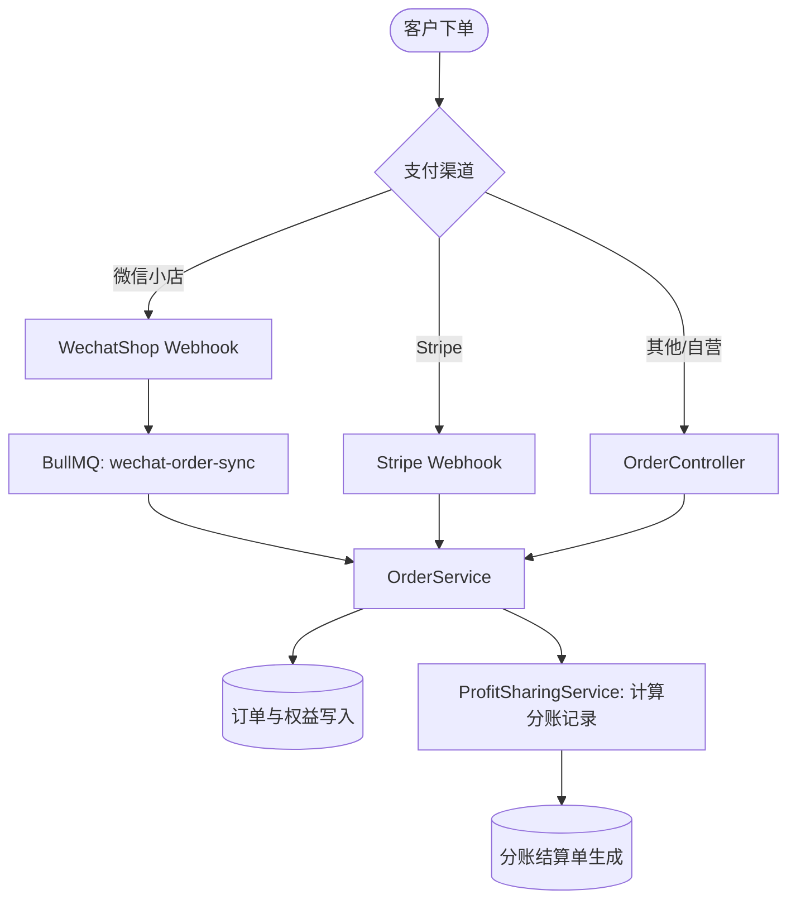

# 商业与交易域 (Commerce & Business)

Nove API 包含完整的商品、订单、退款、渠道管理、分账结算与第三方支付接入体系，支撑 SaaS 订阅、单次付费与生态伙伴结算。

## 领域模块划分

| 模块 | 目录 | 核心职责 |
|---|---|---|
| **商品模块** | `src/product` | 管理售卖商品、类目、价格体系及 SKU 属性 |
| **渠道模块** | `src/channel` | 管理销售渠道来源（自营 Web、微信小店、分销代理等） |
| **订单模块** | `src/order` | 订单生命周期、支付状态流转、订单权益发放 |
| **退款模块** | `src/order-refund` | 退款申请审批、退款原路返回及权益回收 |
| **分账模块** | `src/profit-sharing` | 分账规则配置、实时分账计算、伙伴提现结算单 (Payslips) |
| **Stripe** | `src/stripe` | 海外信用卡与支付凭据处理、Webhook 异步验签与事件分发 |
| **微信小店** | `src/wechat-shop` | 微信视频号/小店订单通知解密、自动同步与队列补偿 |

## 核心业务链路

## 管理后台 API 端点概览

接口均要求具备后台管理员认证与对应领域权限：

### 1. 订单与退款
- `GET /admin/orders`：分页检索订单列表，支持按渠道、时间、支付状态筛选。
- `GET /admin/orders/:id`：订单详细信息，包括购买用户、关联商品及履约权益。
- `POST /admin/orders/:id/benefits`：手动发放或调整订单权益。
- `GET /admin/order-refunds`：退款单据列表。
- `POST /admin/order-refunds`：发起或审核售后退款。

### 2. 商品与渠道
- `GET/POST/PUT/DELETE /admin/products`：商品基础信息与状态控制。
- `GET/POST/PUT/DELETE /admin/channels`：业务渠道注册与接入密钥管理。

### 3. 分账体系
- `GET/POST/PUT/DELETE /admin/profit-sharing-rules`：配置各方分账比例与生效周期。
- `GET /admin/profit-sharing-records`：查看订单产生的分账明细记录。
- `GET/POST /admin/profit-sharing-payslips`：生成与导出分账结算单。
